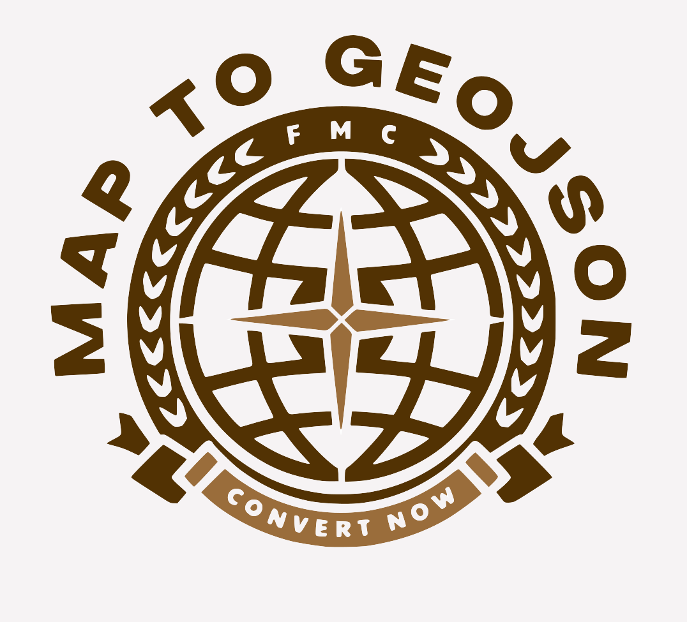

<p align="center">
  
</p>

<h1 align="center">Map to GeoJSON Converter</h1>

<p align="center">
  <a href="https://github.com/ironn0/Map_to_Geojson-Converter/releases/tag/v0.1.3"></a>
  <a href="https://github.com/ironn0/Map_to_Geojson-Converter"></a>
  <a href="https://www.python.org/"></a>
  <a href="LICENSE"></a>
</p>

<p align="center">
  A free, open-source tool to convert map images (PNG, JPG) and SVG files into GeoJSON format, using AI and computer vision. Born as an alternative to expensive databases like Geochron (500€), enabling accessible geospatial data creation.
</p>

---

## Table of Contents
- [Highlights](#highlights)
- [Web App (New!)](#-web-app-new)
- [Background](#background)
- [Quick Start](#quick-start)
- [Usage](#usage)
- [Features](#features)
- [Algorithm Overview](#algorithm-overview)
- [Outputs](#outputs)
- [Limitations & Roadmap](#limitations--roadmap)
- [Contributing](#contributing)
- [Documentation](#documentation)
- [References](#references)

---

## Highlights
- 🆓 **Free & Open-Source**: No costs, ideal for students and researchers.
- � **Web Interface**: Modern browser-based app with interactive georeferencing.
- 🎨 **AI-Powered**: Uses K-Means segmentation and edge detection for automatic polygon extraction.
- 🗺️ **Multiple Inputs**: Supports images (PNG, JPG, WebP) and SVG files.
- 📦 **GeoJSON Export**: Outputs standard GeoJSON FeatureCollection.
- 🔄 **Real-time Preview**: See your regions on a real map before exporting.

---

## Background
This project was created by students to provide free access to geospatial data. Commercial services charge money for databases, making them inaccessible for educational projects. Our tool leverages open-source libraries (OpenCV, GDAL, PyTorch) to convert simple map images into usable GeoJSON files.

### 🎯 What It Does

Transform map images into GeoJSON automatically:

| Input Map | Output (Detected Regions) |
|-----------|---------------------------|
|  |  |

The tool extracts colored regions, identifies boundaries, and generates GeoJSON files ready for use in GIS applications.

---

## 🌐 Web App (New!)

The latest version includes a **full-featured web interface** for easy map conversion:

| Input: Historical Map | Output: Georeferenced GeoJSON |
|----------------------|-------------------------------|
|  |  |

### Key Features
- 🖼️ **Drag & Drop Upload**: Simply drop your map image
- 🎯 **Interactive Segmentation**: Adjust colors and sensitivity in real-time
- 🗺️ **Visual Georeferencing**: Drag corners on a real map to align your image
- ✏️ **Polygon Editor**: Edit, merge, split, and rename regions
- 💾 **One-Click Export**: Download GeoJSON ready for GIS software

### Quick Start (Web App)
```bash
cd src/tests/webapp_modular
pip install -r requirements.txt
uvicorn main:app --reload
```
Open http://localhost:8000 in your browser.

---

## Quick Start
### Prerequisites
- Python 3.8+ ([Download](https://www.python.org/downloads/))

### Required Libraries
| Library | Purpose |
|---------|---------|
| `fastapi` | Web framework for the app |
| `uvicorn` | ASGI server to run the app |
| `opencv-python` | Image processing & segmentation |
| `numpy` | Array operations |
| `Pillow` | Image loading |
| `shapely` | Polygon operations |
| `pydantic` | Data validation |
| `python-multipart` | File upload handling |

### One-Command Installation & Run (Windows)
```bash
# Clone the repository
git clone https://github.com/ironn0/Map_to_Geojson-Converter.git
cd Map_to_Geojson-Converter

# Create virtual environment, install deps, and run
python -m venv .venv && .venv\Scripts\activate && pip install -r requirements.txt && cd src/tests/webapp_modular && uvicorn main:app --reload
```

### Step-by-Step Installation
```bash
# 1. Clone the repository
git clone https://github.com/ironn0/Map_to_Geojson-Converter.git
cd Map_to_Geojson-Converter

# 2. Create virtual environment
python -m venv .venv

# 3. Activate virtual environment
.venv\Scripts\activate        # Windows
# source .venv/bin/activate   # Linux/Mac

# 4. Install dependencies
pip install -r requirements.txt

# 5. Run the web app
cd src/tests/webapp_modular
uvicorn main:app --reload
```

Then open **http://localhost:8000** in your browser.

### Run CLI Scripts (Alternative)
```bash
# Image to GeoJSON with AI
python "src/tests/test SAM/map_to_geojson.py"

# SVG to GeoJSON
python "src/test svg to geojson/Svg_to_Geojson_Converter.py"
```

---

## Usage
1. Prepare your map image or SVG file.
2. Run the appropriate script.
3. Choose calibration (Italy preset or manual).
4. Outputs: GeoJSON file and debug images.

For detailed pipeline, see `src/test con ai/pipeline.md`.

---

## Features
- **Web Interface**: Modern, responsive UI with step-by-step workflow.
- **Image Conversion**: Extract polygons from map images using K-Means segmentation and edge detection.
- **SVG Support**: Convert SVG paths to GeoJSON.
- **Interactive Georeferencing**: Visual corner-dragging on Leaflet map for precise alignment.
- **Polygon Editor**: Select, edit vertices, merge, split, duplicate, rename regions.
- **Manual Drawing**: Add custom polygons and points directly.
- **Real-time Preview**: See regions on actual geographic map before export.
- **Debug Visuals**: Segmented and region overlay images.

---

## Algorithm Overview
- **Preprocessing**: Image segmentation with K-Means or AI models.
- **Contour Detection**: Use OpenCV to find shapes.
- **Filtering**: Remove noise, water, etc., based on heuristics.
- **Georeferencing**: Map pixels to coordinates.
- **Export**: Generate GeoJSON with properties (id, color, area).

See `src/test con ai/pipeline.md` for full architecture.

---

## Outputs
- **GeoJSON File**: FeatureCollection with polygons.
- **Debug Images**: `_segmented.png` (clusters), `_regions.png` (polygons).
- Visualize at https://geojson.io.

---

## Limitations & Roadmap
- Works best on maps with distinct colored regions.
- Complex historical maps may need manual polygon editing.
- ✅ ~~Web interface~~ - **Completed!**
- Future: Batch processing, AI-assisted labeling, territory alignment with official borders.

See `docs/feasibility/StudioDiFattibilità.md` for detailed feasibility study.

---

## Contributing
We welcome contributions! Open issues or PRs. Focus areas:
- Improve AI segmentation.
- Add more input formats.
- Enhance georeferencing.

For requirements gathering, see `docs/feasibility/requirements/`.

---

## Documentation
- **Web App**: `src/tests/webapp/README.md`
- **Modular Version**: `src/tests/webapp_modular/README.md`
- **Feasibility Study**: `docs/feasibility/README.md`
- **Requirements**: `docs/feasibility/requirements/`
- **Contributing**: `CONTRIBUTING.md`
- **Examples**: `examples/`
- **Changelog**: `CHANGELOG.md`

---

## References
- **Web App**: `src/tests/webapp/` - Full-featured browser interface
- **Modular Version**: `src/tests/webapp_modular/` - Refactored codebase
- **CLI Tools**: `src/tests/test SAM/` - Command-line scripts
- Inspired by open-source GIS tools like QGIS and GDAL.
- For feedback, open GitHub Issues or Discussions.

---